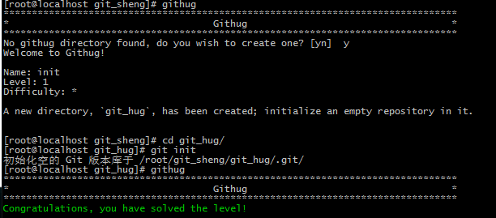

#Name: init    

>*Difficulty:* [x]  
>
>A new directory, `git_hug`, has been created; initialize an empty repository in it.  
  
Solution  
-------------------------
  

`git init`  
在当前文件夹初始化一个空的 `git` 库或重新初始化已存在的 `git` 库
