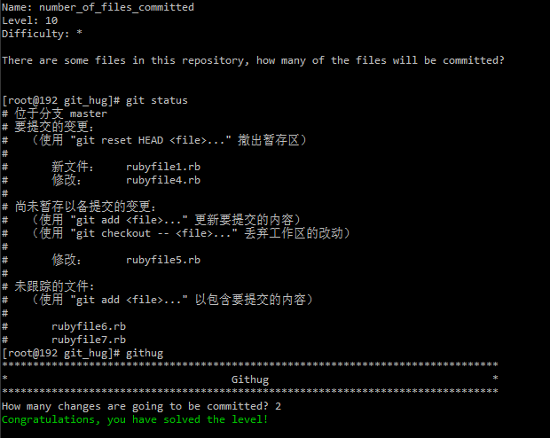

#Name: number_of_files_committed    

>*Difficulty:* [x]  
>
>There are some files in this repository, how many of the files will be committed?

Solution  
-------------------------
  

**tips:**  

* 只有暂存区`index`内的文件会被提交