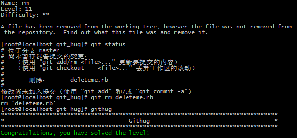

#Name: rm  

>*Difficulty:* [x][x]  
>
>A file has been removed from the working tree, however the file was not removed from the repository.  Find out what this file was and remove it.

Solution  
-------------------------
  

`git rm <file>`  
将文件从index中及工作目录总删除。