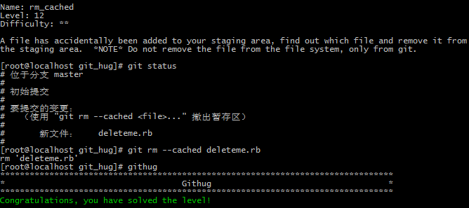

#Name: rm_cached    

>*Difficulty:* [x][x]  
>
>A file has accidentally been added to your staging area, find out which file and remove it from the staging area.  *NOTE* Do not remove the file from the file system, only from git.
  
Solution  
-------------------------
  

`git rm --cached <file>`  
仅将文件从index中删除，工作目录的文件，无论修改与否都不改变。