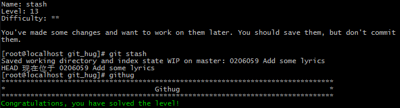

#Name: stash    

>*Difficulty:* [x][x]  
>
>You've made some changes and want to work on them later. You should save them, but don't commit them.
  
Solution  
-------------------------
  

`git stash`  
对当前未提交的环境做存档，以便于多任务切换不会互相影响。

list  
	查看存档列表 

clear  
	清空存档

drop <stash>  
	删除指定存档

apply <stash>  
	应用指定存档

pop  
	弹出栈顶存档并应用