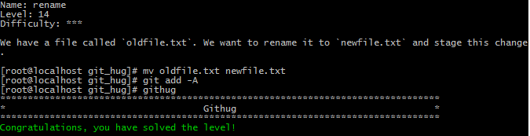

#Name: rename    

>*Difficulty:* [x][x][x]  
>
>We have a file called `oldfile.txt`. We want to rename it to `newfile.txt` and stage this change.
  
Solution  
-------------------------
  

`mv`  
移动文件位置，名字不一样则重命名。linux指令，非git。
