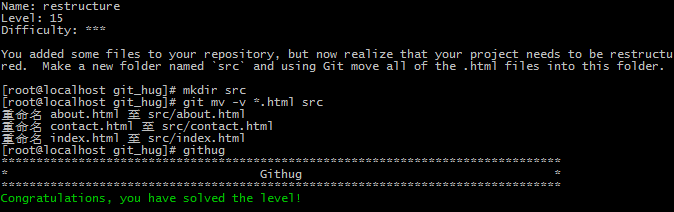

#Name: restructure    

>*Difficulty:* [x][x][x]  
>
>You added some files to your repository, but now realize that your project needs to be restructured.  Make a new folder named `src` and using Git move all of the .html files into this folder.
  
Solution  
-------------------------
  

`git mv`  
移动或重命名文件及目录。

-v  
	列出具体操作动作  
