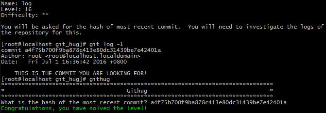

#Name: log    

>*Difficulty:* [x][x]  
>
>You will be asked for the hash of most recent commit.  You will need to investigate the logs of the repository for this.
  
Solution  
-------------------------
  

`git log`  
查看版本历史记录。

-n  
	查看记录数限制为n条  
