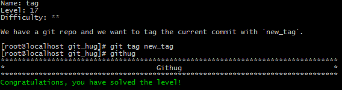

#Name: tag    

>*Difficulty:* [x][x]  
>
>We have a git repo and we want to tag the current commit with `new_tag`.
  
Solution  
-------------------------
  

`git tag`  
列出现有的tag。

`git tag <tagname>`  
	在当前分支顶部创建一个名称为tagname的tag。  