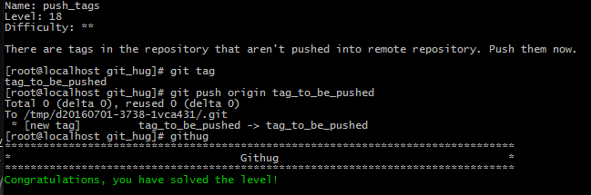

#Name: push_tags    

>*Difficulty:* [x][x]  
>
>There are tags in the repository that aren't pushed into remote repository. Push them now.
  
Solution  
-------------------------
  

`git push <repository> <tagname>`  
提交tag到远程（新建远程tag）
