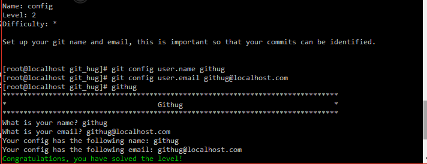

#Name: config    

>*Difficulty:* [x]  
>
>Set up your git name and email, this is important so that your commits can be identified.
  
Solution  
-------------------------
  

`git config`  
用于设置/显示资源库的属性配置。

--global  
	参数--global可以设置全局属性
-l;--list
	列出已有属性及其值