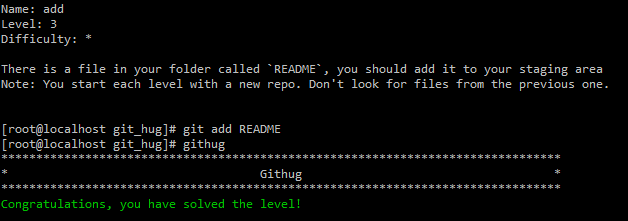

#Name: add    

>*Difficulty:* [x]  
>
>There is a file in your folder called `README`, you should add it to your staging area
>Note: You start each level with a new repo. Don't look for files from the previous one.
  
Solution  
-------------------------
  

`git add`  
将已修改或者新建的文件加入暂存区`index`，以备后续提交。  

`git add .`   
	将当前`Path`下所有修改过或新增的文件加入`index`  

-f  --force   
	即使符合忽略规则同样加入`index`

**tips:**可以使用通配符