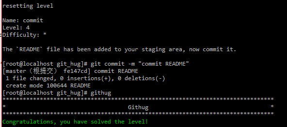

#Name: commit    

>*Difficulty:* [x]  
>
>The `README` file has been added to your staging area, now commit it.
  
Solution  
-------------------------
  

`git commit`  
将已暂存的文件提交到本地库。  

-a  
--all
    将未暂存（add）的已修改文件也进行提交，该操作不会提交新增文件  
-m `msg`  
--message=`msg`  
	使用`msg`作为提交日志而不掉用编辑器书写日志  
