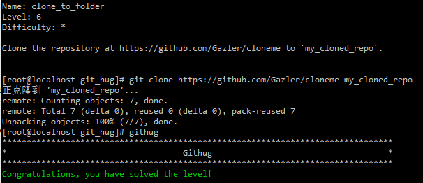

#Name: clone_to_folder    

>*Difficulty:* [x]  
>
>Clone the repository at https://github.com/Gazler/cloneme to `my_cloned_repo`.
  
Solution  
-------------------------
  

`git clone` `url` `folder`  
`clone`一个新的资源库到指定的文件夹`folder`。  

