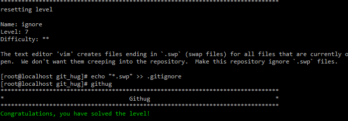

#Name: ignore    

>*Difficulty:* [x][x]  
>
>The text editor 'vim' creates files ending in `.swp` (swap files) for all files that are currently open.  We don't want them creeping into the repository.  Make this repository ignore `.swp` files.

  
Solution  
-------------------------
  

设置基本规则：  

* 以斜杠`/`开头表示目录
* 以星号`*`通配多个字符
* 以问号`?`通配单个字符
* 以方括号`[]`包含单个字符的匹配列表
* 以叹号`!`表示不忽略(跟踪)匹配到的文件或目录

