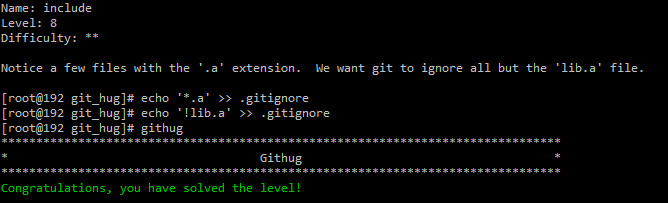
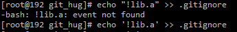

#Name: include    

>*Difficulty:* [x][x]  
>
>Notice a few files with the '.a' extension.  We want git to ignore all but the 'lib.a' file.

  
Solution  
-------------------------
  

**tips:**  

* echo 包含`!`的时候会报错  
	因为`!`会被当作命令行历史替换的符号来处理，而且你无法使用转义符来转义  
	解决方案时使用单引号  
  